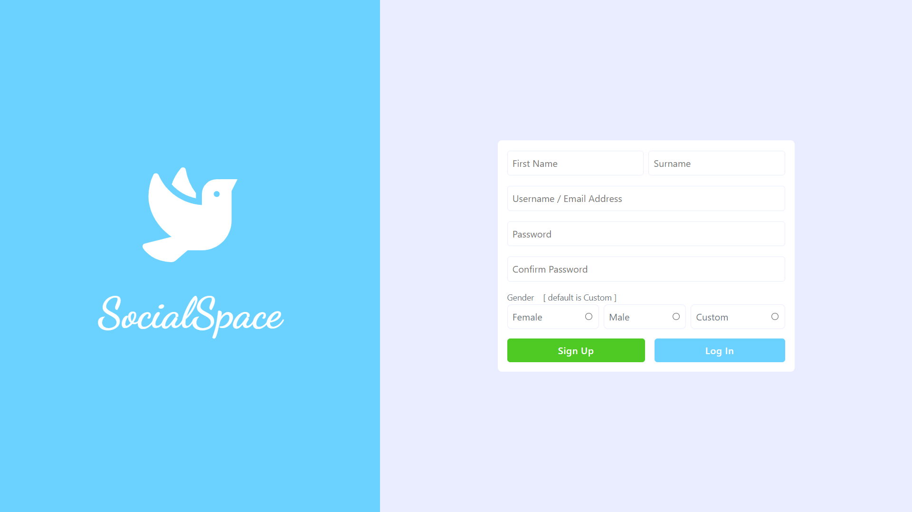
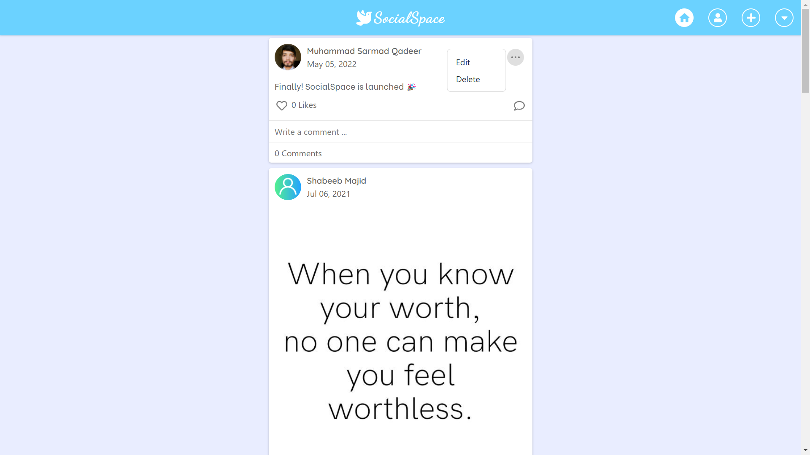
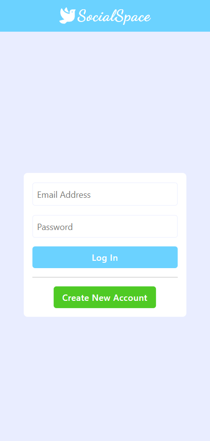
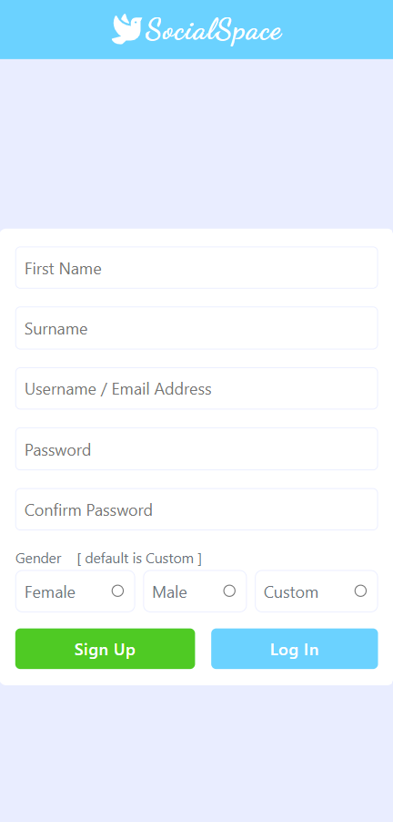
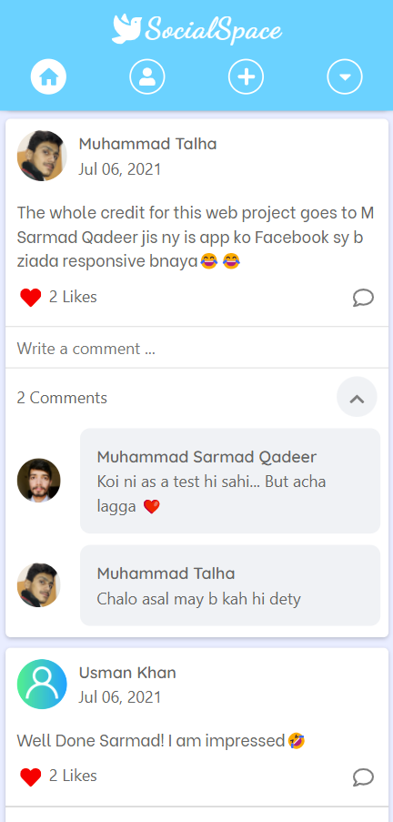
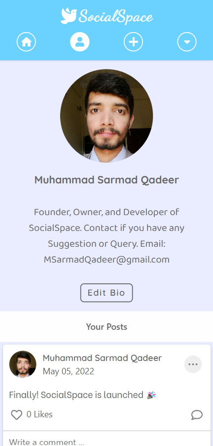
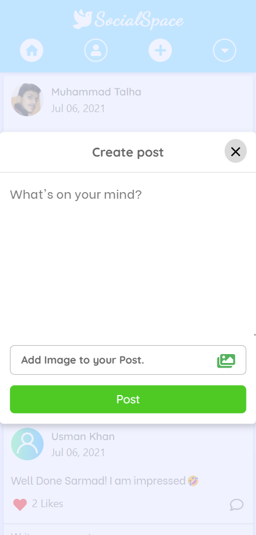
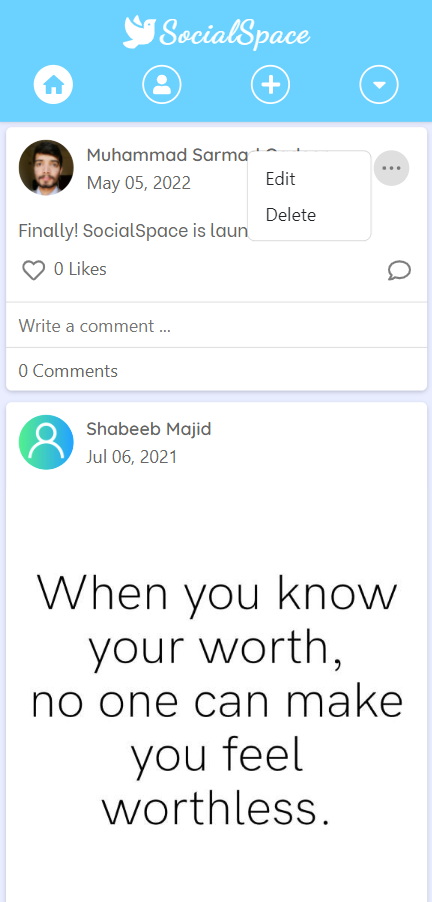
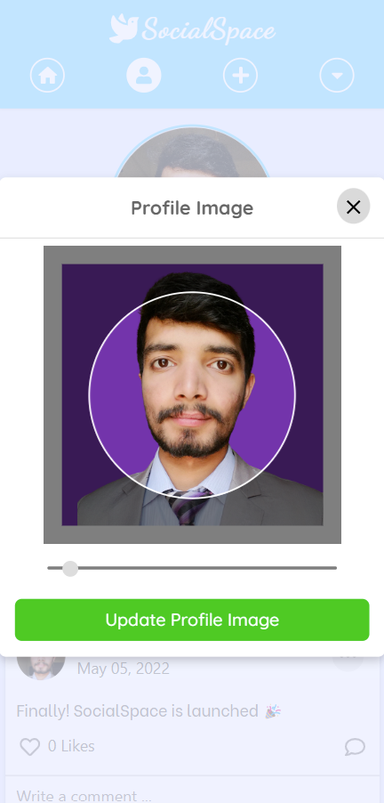

<h1 align="center" style="font-size: 52px;" > SocialSpace - A Social Media Platform</h1>
It is a social media website that has been created using Laravel. It has the implementation of some basic social media functionalities like creating posts, liking posts, commenting on posts, etc.

<br/>
<br/>


## 🛠 Installation & Set Up

1. Download and Install **xampp**
2. Set PHP path
3. Download and install **Composer**
4. Run the following commands:

```shell
git clone https://github.com/MSarmadQadeer/SocialSpace.git
cd SocialSpace
composer install
cp .env.example .env
php artisan key:generate
```

5. Create a Database of name **socialspace** and run the following command:

```shell
php artisan migrate
```

6. Run it by executing:

```shell
php artisan serve
```

## :camera_flash: Screens

### Login Screen


### Signup Screen



### Home Screen


### Profile Screen


### Create Post


### Edit or Delete your Post



### Upload Profile Pic


      

## 🎯 Features

### Implemented

✅ Log In

✅ Sign Up

✅ Create Post

✅ Edit Post

✅ Delete Post

✅ Like Post

✅ Comment on Post

✅ View Profiles

✅ Upload Profile Pic

✅ Edit Bio

✅ Log Out

### Remaining

❗ Change Password

❗ Delete Account

## 🔑 License

-   This project is licensed under the MIT License - see the [LICENSE](LICENSE.md) file for details

## 🧑 Author

#### Muhammad Sarmad Qadeer

[](https://www.linkedin.com/in/msarmadqadeer/)

You can also follow my GitHub Profile to stay updated about my latest projects:

[](https://github.com/MSarmadQadeer)

If you liked the repo then kindly support it by giving it a star ⭐!

Copyright (c) 2022 MUHAMMAD SARMAD QADEER
