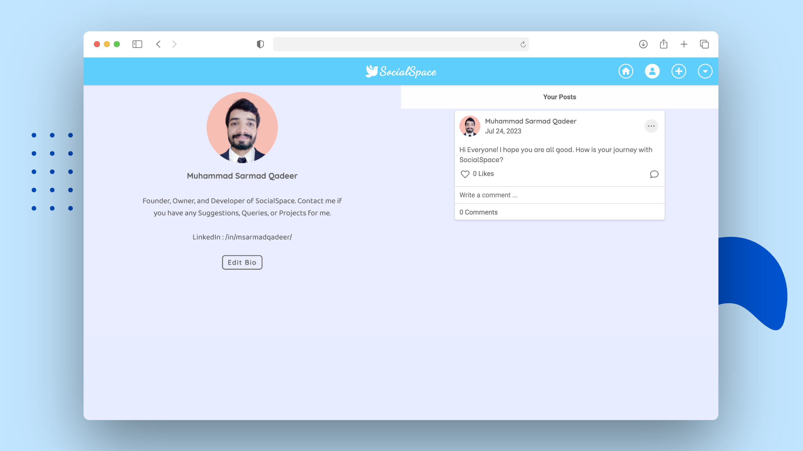
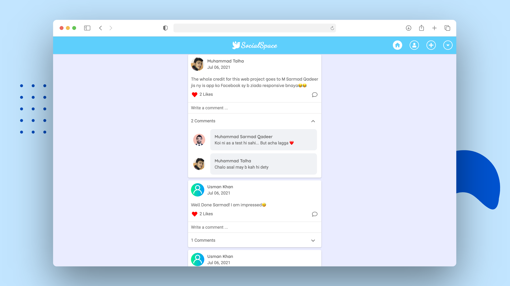
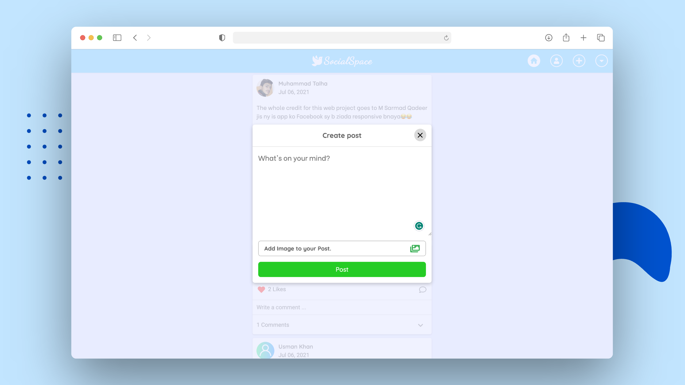

<h1 align="center" style="font-size: 52px;" > SocialSpace - A Social Media Platform</h1>

This is a full-stack web application that functions as a social media platform. The application includes key social media features, enabling users to create, like, and comment on posts. The aim is to provide a user-friendly and engaging platform where individuals can share their thoughts, interact with others, and stay connected. Each feature is designed with an emphasis on ease of use, promoting a seamless social media experience.

<br/>


## 🛠 Installation & Set Up

1. Clone the Repository

```shell
git clone https://github.com/MSarmadQadeer/SocialSpace.git
```

2. Install Composer Dependencies

```shell
cd SocialSpace
composer install
```

3. Create a .env File

```shell
cp .env.example .env
```

4. Generate an App Key

```shell
php artisan key:generate
```

5. Create an empty database

-   Create an empty database of name **socialspace** or any other name you want, using the database tool you prefer.

6. Configure your .env File

-   Open the **.env** file in your editor and set the **DB_HOST**, **DB_PORT**, **DB_DATABASE**, **DB_USERNAME**, and **DB_PASSWORD** environment variables to match the credentials of the database you just created.

7. Migrate the Database

```shell
php artisan migrate
```

8. Run the Project

```shell
php artisan serve
```

## :whale: Docker Installation & Set Up

1. Download and Install **Docker**
2. Run the following commands:

```shell
git clone https://github.com/MSarmadQadeer/SocialSpace.git
cd SocialSpace
cp .env.docker-example .env
docker-compose up -d
```

## For Jenkins

You need to specify your Docker Hub username and password as environment variables in your Jenkins instance, using the **DOCKER_HUB_USERNAME** and **DOCKER_HUB_PASSWORD** variables respectively.

## :camera_flash: Project Showcase

### 📱 Mobile View


### 🖥 Desktop View






## 🎯 Features

### Implemented

✅ Log In

✅ Sign Up

✅ Create Post

✅ Edit Post

✅ Delete Post

✅ Like Post

✅ Comment on Post

✅ View Profiles

✅ Upload Profile Pic

✅ Edit Bio

✅ Log Out

### Remaining

❗ Change Password

❗ Delete Account

## 🙌 Contribution Guidelines

We welcome contributions from the community. To submit a pull request:

1. Fork the repository.
2. Clone the forked repository.
3. Create a new branch for your contribution.
4. Make the changes.
5. Commit and push the changes to your forked repository.
6. Create a pull request.

## 🔑 License

This project is licensed under the MIT License - see the [LICENSE](LICENSE.md) file for details

## 🧑 Author

#### Muhammad Sarmad Qadeer

[](https://www.linkedin.com/in/msarmadqadeer/)

You can also follow my GitHub Profile to stay updated about my latest projects:

[](https://github.com/MSarmadQadeer)

If you liked the repo then kindly support it by giving it a star ⭐!

Copyright (c) 2023 MUHAMMAD SARMAD QADEER
